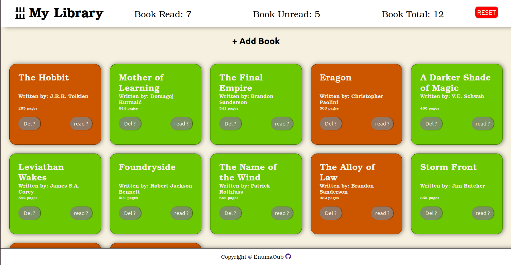
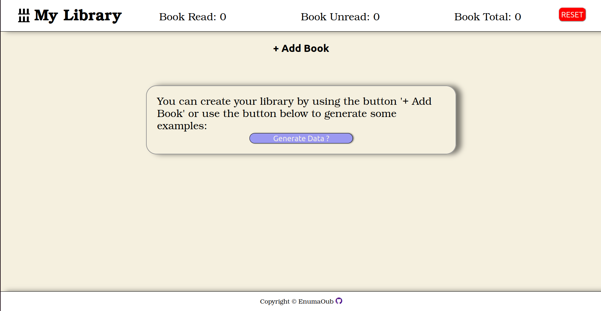

# Library

## Description
Little project to apply what I've learned of Html, CSS and base of OOP javascript.
Store book data in constructor and create new book with form.
The library is completly in a factory function.
The data is locally stored allowing for the library to keep its data when we refresh.

We have a button allowing for auto population to test it.

